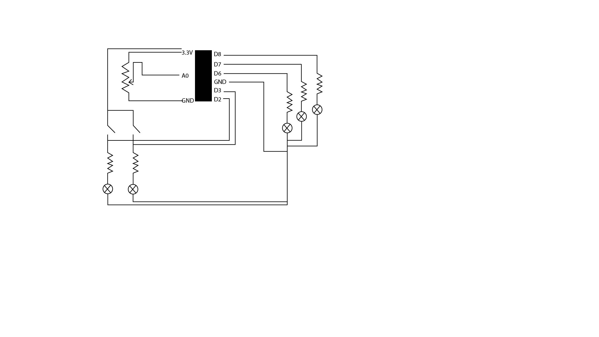
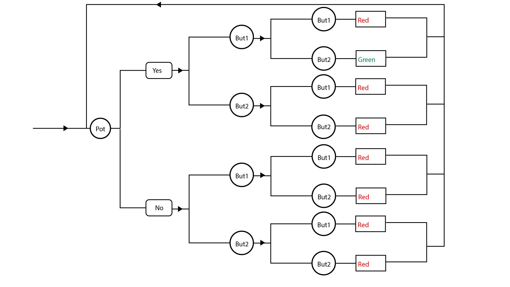

# HW11
Generally the logic is: When the potentiometer is not turned, when the first button-press event happens, it should give no reaction. When the second button-press event happens, it should give the red light. When the potentiometer is turned, if button 1 is pressed, it should give no reaction just yet. If the second button pressed is button 2, it should give a green light. If the second button pressed is button 1, it should give a red light. When the potentiometer is turned, if button 2 is pressed as the first button-pressed event, it should display nothing just yet. Whatever button is pressed as a second button, it should display a red light. When either the red or green light is displayed, reset the status.

The way to enter the password is: Turn the potentiometer to its right half (until the blue light is on), then press button 1 (short one), then press button 2 (tall one), when the button is pressed, the yellow leds would be on to confirm the button is press as an user interface element. If enter in this way, the green light would be on, if not, red light would be on...

Image on repo:  

